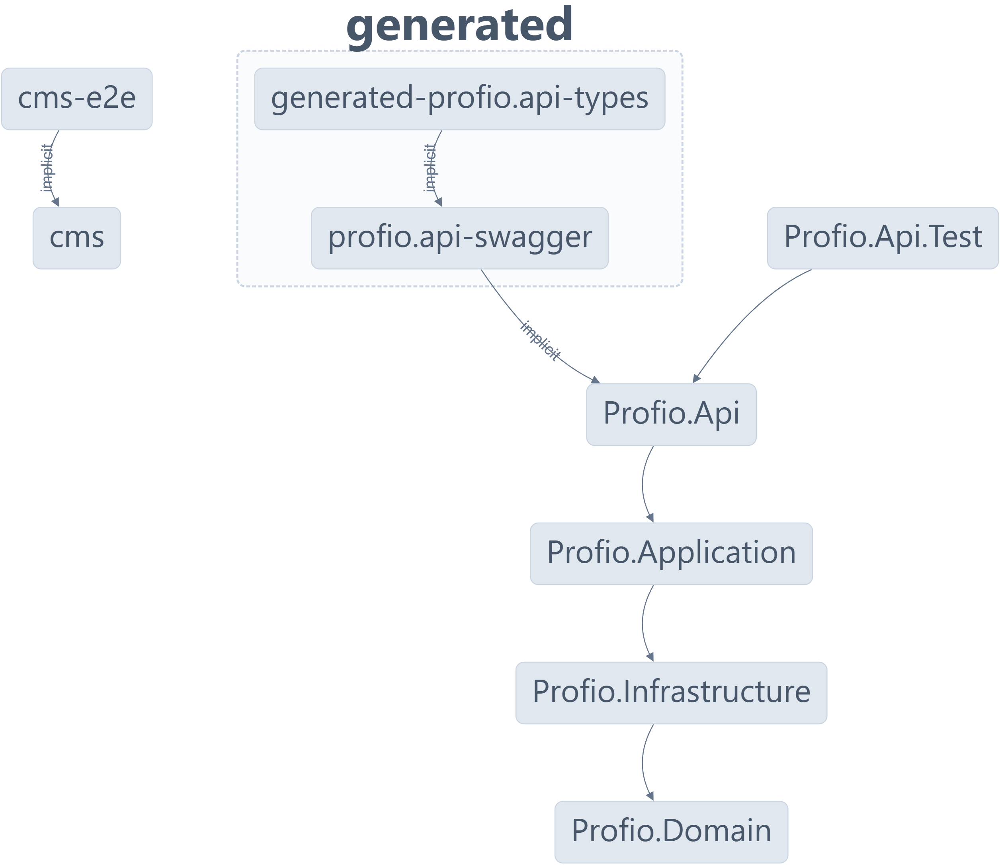

<h1 align="center">
	<p></p>
Profio Application
</h1>

<p align="center">
	Profio Application is a monorepo project built with <a href="https://nx.dev/">Nx</a> technology. It is a set of extensible dev tools for monorepos, which helps you develop like Google, Facebook, and Microsoft.
</p>

# Overview

<p align="justify">
	Profio - the symbol of professionalism in transportation management. Whether you need a solution for managing a fleet of vehicles or ships, Profio provides a powerful tool, optimizing and simplifying the process, ensuring every movement is quick, safe, and efficient
</p>

# Getting Started

## 💻 Infrastructure

<ul>
	<li align="justify">
		<b><a href="https://nx.dev" target="_blank">Nx</a></b> - Nx is a set of 	extensible dev tools for monorepos, which helps you develop like Google, 	Facebook, and Microsoft.
	</li>
	<li align="justify">
		<b><a href="https://nodejs.org/en/" target="_blank">node.js</a></b> - Node.	js® is a JavaScript runtime built on Chrome's V8 JavaScript engine.
	</li>
	<li align="justify">
		<b><a href="https://www.npmjs.com/" target="_blank">npm</a></b> - npm is 	the package manager for the Node JavaScript platform.
	</li>
	<li align="justify">
		<b><a href="https://dotnet.microsoft.com/" target="_blank">.NET Core</a></b> - .NET is a developer platform with tools and libraries for building 	any type of app, including web, mobile, desktop, games, IoT, cloud, and 	microservices.
	</li>
	<li align="justify">
		<b><a href="https://www.docker.com/" target="_blank">Docker (Kubernetes 	Enabled)</a></b> - Docker is an open platform for developing, shipping, 	and running applications.
	</li>
	<li align="justify">
		<b><a href="https://docs.microsoft.com/en-us/windows/wsl/install-win10" 	target="_blank">WSL 2</a></b> - WSL 2 is a new version of the architecture 	that powers the Windows Subsystem for Linux to run ELF64 Linux binaries on 	Windows.
	</li>
</ul>

## 📦 Services

<ul>
	<li align="justify">
		<b><a href="https://render.com/" target="_blank">Render</a></b> - Render 	is a unified platform to build and run all your apps and websites with 	free SSL, global CDN, private networks and auto deploys from Git.
	</li>
	<li align="justify">
		<b><a href="https://redislabs.com/" target="_blank">Redis Labs</a></b> - 	Redis Labs is the home of Redis, the world’s most popular in-memory 	database, and commercial provider of Redis Enterprise.
	</li>
	<li align="justify">
		<b><a href="https://azure.microsoft.com/" target="_blank">Azure</a></b> - 	Azure is an ever-expanding set of cloud computing services to help your 	organization meet its business challenges.
	</li>
	<li align="justify">
		<b><a href="https://www.cloudamqp.com/" target="_blank">CloudAMQP</a></b> 	- CloudAMQP automates every part of setup, running and scaling of RabbitMQ 	clusters. Available on all major cloud and application platforms.
	</li>
	<li align="justify">
		<b><a href="https://www.emqx.io/" target="_blank">EMQX</a></b> - EMQ X 	Broker is a fully open source, highly scalable, highly available 	distributed MQTT messaging broker for IoT, M2M and Mobile applications 	that can handle tens of millions of concurrent clients.
	</li>
</ul>

## 🛠️ Setup

First, clone the repository to your local machine:

```bash
git clone https://github.com/HutechCJ/ProfioApp.git
```

Next, navigate to the root directory of the project and install the dependencies:

```bash
npm install --force
```

## 🚀 Running the application

For the CMS, navigate to the `apps/cms` directory and run the following command:

```bash
npx nx serve cms
```

For the API, navigate to the `apps/Profio.Api` directory and run the following command:

```bash
npx nx serve Profio.Api
```

For running all applications, navigate to the root directory of the project and run the following command:

```bash
npx nx run-many --target=serve --all
```

## 🧪 Testing the application

For the CMS, navigate to the `apps/cms-e2e` directory and run the following command:

```bash
npx nx e2e cms-e2e
```

For the API, navigate to the `apps/Profio.Api` directory and run the following command:

```bash
npx nx test Profio.Api
```

## 🐳 Running services with Docker

For running all services, navigate to the root directory of the project and run the following command:

```bash
docker-compose up -d
```

<p align="justify">
	<b>Note:</b> If the sebp/elk image is not running, you can have to set the <code>vm.max_map_count</code> kernel setting to at least <code>262144</code>. To do this, execute the <code>update_sysctl.sh</code> script in the WSL terminal.
</p>

# Dependency Graph

You can see the dependency graph of the project by running the following command:

```bash
npx nx dep-graph
```

Here is the dependency graph of the project:

<p align="center">
	
</p>

# License

This project is licensed under the MIT License - see the [LICENSE](LICENSE) file for details
