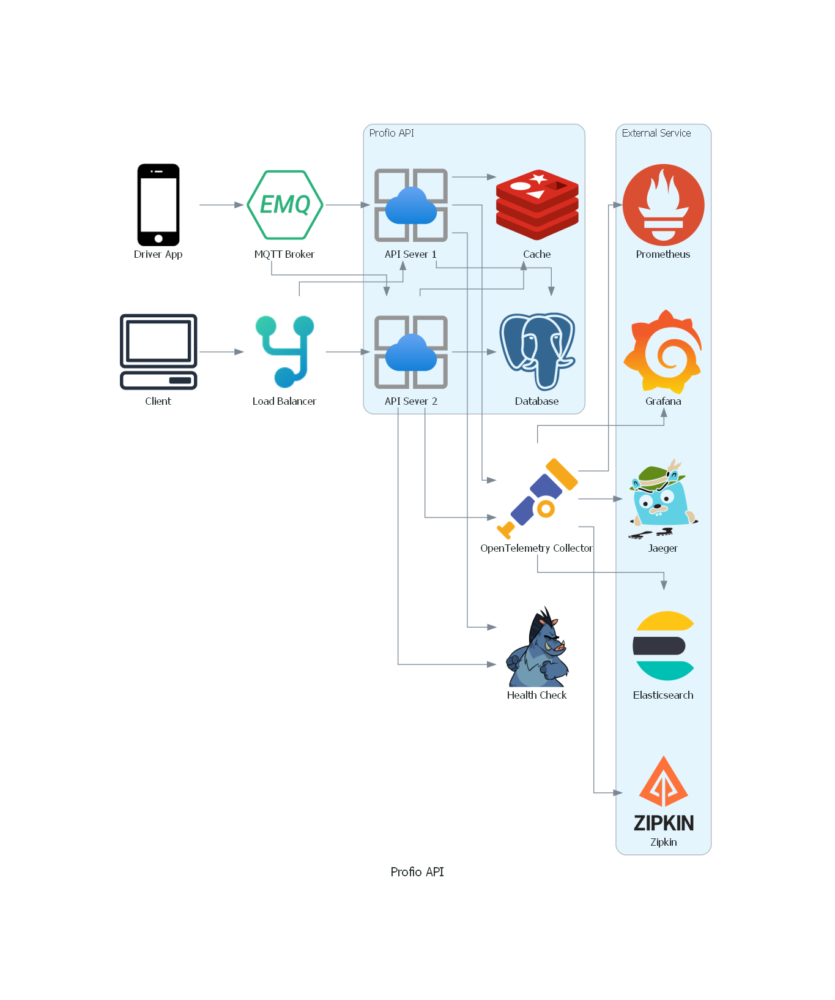
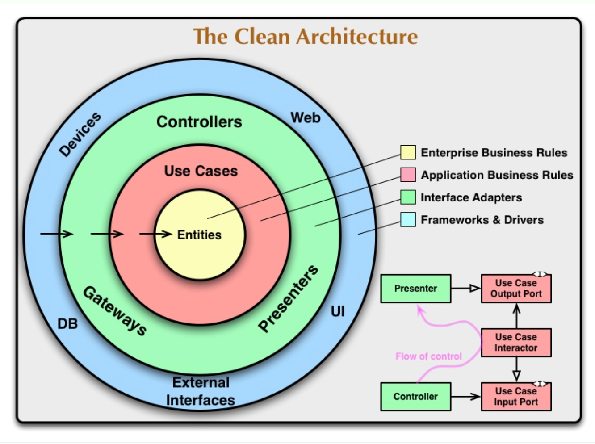
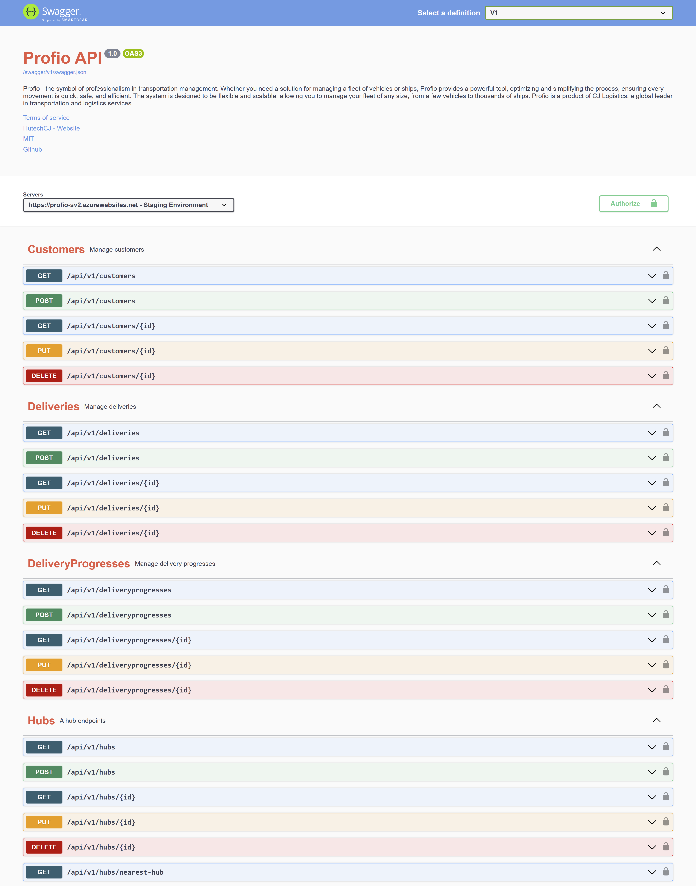
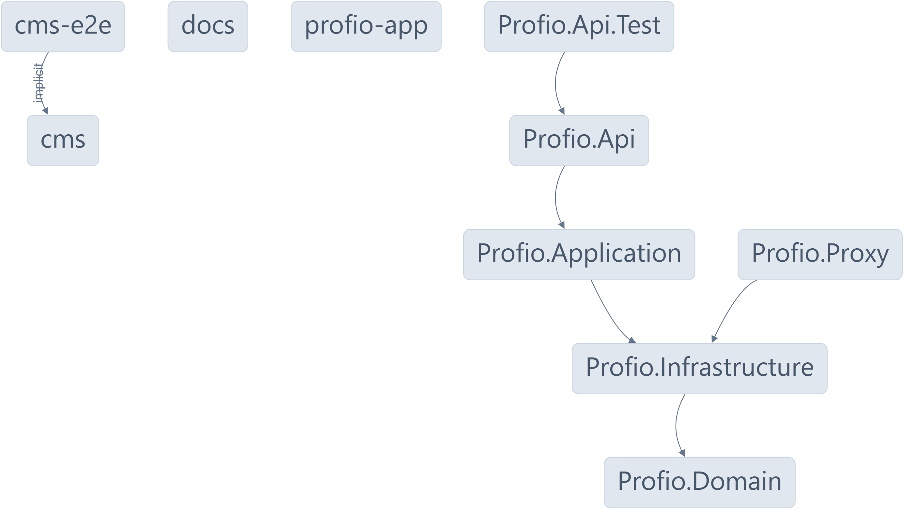

<div align="center">
	<picture>
		
	</picture>
	<p>
		<a href="https://app.deepsource.com/gh/HutechCJ/ProfioApp/?ref=repository-badge" target="_blank">
			
		</a>
		<a href="https://github.com/HutechCJ/ProfioApp/network/updates" target="_blank">
			
		</a>
		<a href="https://profioapp.azurewebsites.net/ " target="_blank">
			
		</a>
		<a href="https://github.com/HutechCJ/ProfioApp/blob/main/LICENSE" target="_blank">
			
		</a>
	</p>
</div>

<hr>

<h1 align="justify"> Profio Application - 🚛 A Logistics Management System ✈️ </h1>

<p align="center">
	Profio Application is a monorepo project built with <a href="https://nx.dev/">Nx</a> technology. It is a set of extensible dev tools for monorepos, which helps you develop like Google, Facebook, and Microsoft.
</p>

<h1>Table of Contents</h1>

- [Overview](#overview)
- [Tentative technologies](#tentative-technologies)
- [Building blocks](#building-blocks)
- [Getting Started](#getting-started)
  - [💻 Infrastructure](#-infrastructure)
  - [📦 Services](#-services)
  - [🛠️ Setup](#️-setup)
  - [🚀 Running the application](#-running-the-application)
  - [🧪 Testing the application](#-testing-the-application)
  - [🐳 Running services with Docker](#-running-services-with-docker)
- [API development](#api-development)
- [Open API](#open-api)
- [Dependency Graph](#dependency-graph)
- [Contributing](#contributing)
- [Contributors](#contributors)
- [License](#license)

# Overview

<p align="justify">
	Profio - the symbol of professionalism in transportation management. Whether you need a solution for managing a fleet of vehicles or ships, Profio provides a powerful tool, optimizing and simplifying the process, ensuring every movement is quick, safe, and efficient.
</p>

<blockquote>
	<p align="justify">
		This is a product of the CJ Code your Future 2023 contest. The purpose of this project is to help CJ Logistics improve the quality of transportation management. This project is not for commercial purposes 👍
	</p>
	<p align="justify">
		We are a group of students from Ho Chi Minh City University of Technology and Education. We are very happy to be able to participate in this contest. We hope that our project will be useful to CJ Logistics.
	</p>
</blockquote>

<p align="justify">
	📑 Read <a href="#" target="_blank">documentation</a> for more information about the project.
</p>

<p align="justify">
	If you want to find out more about the contest, please visit the <a href="https://www.facebook.com/itHutech/posts/pfbid033vvjf1btrN6JdvRoPrqarKHjqYQv5cBWyayJ5ghi1g9oRXDWCi9drQFinh8pM4YJl" target="_blank">CJ Code Your Future</a> from the Hutech IT Fanpage.
</p>

# Tentative technologies

- Next.js 13
- ASP.NET Core 7
- Flutter 3.13
- Python 3.11
- RabbitMQ
- Redis
- PostgreSQL
- MQTT Broker
- DeepSource
- CircleCI
- K8s, Helm
- OpenTelemetry
- ELK Stack, Grafana, Prometheus, Jaeger, Zipkin

# Building blocks



<table>
  <thead>
    <th>Name</th>
    <th>Usecase</th>
    <th>Technology</th>
  </thead>
  <tbody>
		<tr>
			<td><b>Client</b></td>
			<td>
				<p align="justify">
					It will show the information of orders, vehicles, drivers, and 	other information related to the transportation process. It will also provide a dashboard for managers to monitor the transportation process.
				</p>
			</td>
			<td>
				<p align="justify">
					Next.js
				</p>
			</td>
		</tr>
		<tr>
			<td><b>Load Balancer</b></td>
			<td>
				<p align="justify">
					It will distribute the load to the available servers. It will also 	provide a dashboard for managers to monitor the load of the servers.
				</p>
			</td>
			<td>
				<p align="justify">
					YARP
				</p>
			</td>
    </tr>
		<tr>
			<td><b>Driver App</b></td>
			<td>
				<p align="justify">
					It provides a dashboard for drivers to monitor the transportation process. It will send the location of the vehicle to the server.
				</p>
			</td>
			<td>
				<p align="justify">
					Flutter
				</p>
			</td>
		</tr>
		<tr>
			<td><b>MQTT Broker</b></td>
			<td>
				<p align="justify">
					It will receive the location of the vehicle from the driver app and send it to the server.
				</p>
			</td>
			<td>
				<p align="justify">
					EMQX
				</p>
			</td>
		</tr>
		<tr>
			<td><b>API Server</b></td>
			<td>
				<p align="justify">
					It will receive the location of the vehicle from the MQTT Broker and send it to the database. It will also send the information of orders, vehicles, drivers, and other information related to the transportation process to the client.
				</p>
			</td>
			<td>
				<p align="justify">
					ASP.NET Core
				</p>
			</td>
		</tr>
		<tr>
			<td><b>Database</b></td>
			<td>
				<p align="justify">
					It will store the information of orders, vehicles, drivers, and other information related to the transportation process. We use Redis to cache the data.
				</p>
			</td>
			<td>
				<p align="justify">
					PostgreSQL, Redis
				</p>
			</td>
		</tr>
		<tr>
			<td><b>OpenTelemetry Collector</b></td>
			<td>
				<p align="justify">
					It will receive the telemetry data from the OpenTelemetry. It will send the telemetry data to the OpenTelemetry Processor.
				</p>
			</td>
			<td>
				<p align="justify">
					OpenTelemetry Collector
				</p>
			</td>
		</tr>
		<tr>
			<td><b>Health Check</b></td>
			<td>
				<p align="justify">
					It will check the health of the servers. It will send the health status of the servers to the Load Balancer.
				</p>
			</td>
			<td>
				<p align="justify">
					ASP.NET Core
				</p>
			</td>
		</tr>
		<tr>
			<td><b>Exporter</b></td>
			<td>
				<p align="justify">
					It will export the telemetry data to the OpenTelemetry Collector.
    		</p>
    		</td>
    		<td>
    			<p align="justify">
    				ELK Stack, Grafana, Prometheus, Jaeger, Zipkin
    			</p>
    		</td>
		</tr>
  </tbody>
</table>

# Getting Started

## 💻 Infrastructure

<ul>
	<li align="justify">
		<b><a href="https://nx.dev" target="_blank">Nx</a></b> - Nx is a set of 	extensible dev tools for monorepos, which helps you develop like Google, 	Facebook, and Microsoft.
	</li>
	<li align="justify">
		<b><a href="https://nodejs.org/en/" target="_blank">node.js</a></b> - Node.	js® is a JavaScript runtime built on Chrome's V8 JavaScript engine.
	</li>
	<li align="justify">
		<b><a href="https://www.npmjs.com/" target="_blank">npm</a></b> - npm is 	the package manager for the Node JavaScript platform.
	</li>
	<li align="justify">
		<b><a href="https://dotnet.microsoft.com/" target="_blank">.NET Core</a></b> - .NET is a developer platform with tools and libraries for building 	any type of app, including web, mobile, desktop, games, IoT, cloud, and 	microservices.
	</li>
	<li align="justify">
		<b><a href="https://https://www.python.org/" target="_blank">Python</a></b> - Python is a programming language that lets 	you work quickly and integrate systems more effectively.
	</li>
	<li align="justify">
		<b><a href="https://flutter.dev/" target="_blank">Flutter</a></b> - Flutter is Google’s UI toolkit for building beautiful, natively 	compiled applications for mobile, web, and desktop from a single codebase.
	</li>
	<li align="justify">
		<b><a href="https://www.docker.com/" target="_blank">Docker (Kubernetes 	Enabled)</a></b> - Docker is an open platform for developing, shipping, 	and running applications.
	</li>
	<li align="justify">
		<b><a href="https://docs.microsoft.com/en-us/windows/wsl/install-win10" 	target="_blank">WSL 2 - Ubuntu OS</a></b> - WSL 2 is a new version of the architecture 	that powers the Windows Subsystem for Linux to run ELF64 Linux binaries on 	Windows.
	</li>
</ul>

## 📦 Services

<ul>
	<li align="justify">
		<b><a href="https://render.com/" target="_blank">Render</a></b> - Render 	is a unified platform to build and run all your apps and websites with 	free SSL, global CDN, private networks and auto deploys from Git.
	</li>
	<li align="justify">
		<b><a href="https://redislabs.com/" target="_blank">Redis Labs</a></b> - 	Redis Labs is the home of Redis, the world’s most popular in-memory 	database, and commercial provider of Redis Enterprise.
	</li>
	<li align="justify">
		<b><a href="https://azure.microsoft.com/" target="_blank">Azure</a></b> - 	Azure is an ever-expanding set of cloud computing services to help your 	organization meet its business challenges.
	</li>
	<li align="justify">
		<b><a href="https://www.cloudamqp.com/" target="_blank">CloudAMQP</a></b> 	- CloudAMQP automates every part of setup, running and scaling of RabbitMQ 	clusters. Available on all major cloud and application platforms.
	</li>
	<li align="justify">
		<b><a href="https://www.emqx.io/" target="_blank">EMQX</a></b> - EMQ X 	Broker is a fully open source, highly scalable, highly available 	distributed MQTT messaging broker for IoT, M2M and Mobile applications 	that can handle tens of millions of concurrent clients.
	</li>
	<li align="justify">
		<b><a href="https://vercel.com/" target="_blank">Vercel</a></b> - Vercel 	is a cloud platform for static sites and Serverless Functions that fits 	perfectly with your workflow. It enables developers to host Jamstack 	websites and web services that deploy instantly, scale automatically, and 	require no supervision, all with no configuration.
	</li>
	<li align="justify">
		<b><a href="https://cloud.google.com/" target="_blank">Google Cloud 	Platform</a></b> - Google Cloud Platform, offered by Google, is a suite of 	cloud computing services that runs on the same infrastructure that Google 	uses internally for its end-user products, such as Google Search, Gmail, 	file storage, and YouTube.
	</li>
</ul>

## 🛠️ Setup

First, clone the repository to your local machine:

```bash
git clone https://github.com/HutechCJ/ProfioApp.git
```

Next, navigate to the root directory of the project and install the dependencies:

```bash
npm install --force
```

## 🚀 Running the application

For the CMS, navigate to the `apps/cms` directory and run the following command:

```bash
npx nx serve cms
```

For the API, navigate to the `apps/Profio.Api` directory and run the following command:

```bash
npx nx serve Profio.Api
```

For running all applications, navigate to the root directory of the project and run the following command:

```bash
npx nx run-many --target=serve --all
```

## 🧪 Testing the application

For the CMS, navigate to the `apps/cms-e2e` directory and run the following command:

```bash
npx nx e2e cms-e2e
```

For the API, navigate to the `apps/Profio.Api` directory and run the following command:

```bash
npx nx test Profio.Api
```

## 🐳 Running services with Docker

For running all services, navigate to the root directory of the project and run the following command:

```bash
docker-compose up -d
```

<p align="justify">
	<b>Note:</b> If the sebp/elk image is not running, you can have to set the <code>vm.max_map_count</code> kernel setting to at least <code>262144</code>. To do this, execute the <code>update_sysctl.sh</code> script in the WSL terminal.
</p>

# API development

We use Clean Architecture for the API development. You can read more about Clean Architecture [here](https://docs.microsoft.com/en-us/dotnet/architecture/modern-web-apps-azure/common-web-application-architectures#clean-architecture). The CQRS and Mediator patterns are also used in the API development. You can read more about CQRS [here](https://docs.microsoft.com/en-us/azure/architecture/patterns/cqrs) and Mediator [here](https://refactoring.guru/design-patterns/mediator).



# Open API



<p align="justify">
	I have implemented ReDoc with the OpenAPI specification is a great way to generate documentation for your API quickly and easily. You can read more about ReDoc <a href="https://profioapp.azurewebsites.net/" target="_blank">here</a>.
</p>

# Dependency Graph

You can see the dependency graph of the project by running the following command:

```bash
npx nx dep-graph
```

Here is the dependency graph of the project, generated by Nx:

<p align="center">
	
</p>

# Contributing

Wanna be here? [Contribute](./.github/CONTRIBUTING.md).

- Fork this repository.
- Create your new branch with your feature: `git checkout -b my-feature`.
- Commit your changes: `git commit -am 'feat: My new feature'`.
- Push to the branch: `git push origin my-feature`.
- Submit a pull request.

# Contributors

Thanks goes to these wonderful people ([emoji key](https://allcontributors.org/docs/en/emoji-key))

<table>
	<tr>
		<td align="center" valign="top">
				
        <br>
        <a href="https://github.com/foxminchan">Xuan Nhan</a>
        <p>
          <a href="https://github.com/HutechCJ/ProfioApp/commits?author=foxminchan" title="Developer">💻</a>
          <a href="#docs" title="Documentation">📖</a>
          <a href="#infra" title="Infrastructure">🚇</a>
          <a href="#tool" title="Tools">🔧</a>
					<a href="#mentoring" title="Mentoring">🧑‍🏫</a>
        </p>
		</td>
		<td align="center" valign="top">
				
        <br>
        <a href="https://github.com/Slimaeus">Hong Thai</a>
        <p>
          <a href="https://github.com/HutechCJ/ProfioApp/commits?author=Slimaeus" title="Developer">💻</a>
          <a href="#infra" title="Infrastructure">🚇</a>
					<a href="#projectManagement" title="Project Management">📆</a>
					<a href="#maintenance" title="Maintenance">🚧</a>
					<a href="#review" title="Reviewed Pull Requests">👀</a>
        </p>
		</td>
		<td align="center" valign="top">
		<td align="center" valign="top">
				
        <br>
        <a href="https://github.com/nhonvo">Truong Nhon</a>
        <p>
          <a href="https://github.com/HutechCJ/ProfioApp/commits?author=nhonvo" title="Developer">💻</a>
          <a href="#ideas" title="Ideas, Planning, & Feedback">🤔</a>
					<a href="#data" title="Data">🔣</a>
					<a href="#business" title="Business Development">💼</a>
        </p>
		</td>
		<td align="center" valign="top">
				
        <br>
        <a href="https://github.com/fiezt1492">Tien Dat</a>
        <p>
          <a href="https://github.com/HutechCJ/ProfioApp/commits?author=fiezt1492" title="Developer">💻</a>
          <a href="#design" title="Design">🎨</a>
					<a href="#content" title="Content">🖋</a>
					<a href="#maintenance" title="Maintenance">🚧</a>
        </p>
		</td>
		<td align="center" valign="top">
				
        <br>
        <a href="https://github.com/MeiCloudie">Thuc Van</a>
        <p>
          <a href="https://github.com/HutechCJ/ProfioApp/commits?author=MeiCloudie" title="Developer">💻</a>
          <a href="#design" title="Design">🎨</a>
					<a href="#content" title="Content">🖋</a>
        </p>
		</td>
	</tr>
</table>

# License

This project is licensed under the MIT License - see the [LICENSE](LICENSE) file for details
