<div align="center">
	<picture>
		
	</picture>
	<p>
    <a href="https://github.com/HutechCJ/ProfioApp/actions/workflows/ci.yml" target="_blank">
      
    </a>
		<a href="https://app.deepsource.com/gh/HutechCJ/ProfioApp/?ref=repository-badge" target="_blank">
			
		</a>
		<a href="https://github.com/HutechCJ/ProfioApp/network/updates" target="_blank">
			
		</a>
		<a href="https://profioapp.azurewebsites.net/ " target="_blank">
			
		</a>
		<a href="https://profio-cms.onrender.com/" target="_blank">
			
		</a>
    <a href="https://gitpod.io/new/#https://github.com/HutechCJ/ProfioApp" target="_blank">
			
		</a>
	</p>
</div>

<hr>

<h1 align="justify"> Profio Application - 🚛 A Modern Logistics Management System ✈️ </h1>

<p align="center">
	Profio Application is a monorepo project built with <a href="https://nx.dev/">Nx</a> technology. It is a set of extensible dev tools for monorepos, which helps you develop like Google, Facebook, and Microsoft.
</p>

<h1>Table of Contents</h1>

- [Overview](#overview)
- [Tentative technologies](#tentative-technologies)
- [Building blocks](#building-blocks)
- [Screenshots](#screenshots)
  - [Website: Home page](#website-home-page)
  - [Website: Lookup page](#website-lookup-page)
  - [Website: Contact page](#website-contact-page)
  - [CMS: Login](#cms-login)
- [Getting Started](#getting-started)
  - [💻 Infrastructure](#-infrastructure)
  - [📦 Services](#-services)
  - [🛠️ Setup](#️-setup)
  - [🚀 Running the application](#-running-the-application)
  - [🐳 Running services with Docker](#-running-services-with-docker)
- [API development](#api-development)
- [Open API](#open-api)
- [Dependency Graph](#dependency-graph)
- [CI/CD](#cicd)
- [External services](#external-services)
  - [📦 Container Management](#-container-management)
  - [🧑‍⚕️ Health Check](#️-health-check)
  - [📊 Monitoring](#-monitoring)
  - [📈 Tracing](#-tracing)
  - [📝 Logging](#-logging)
  - [📦 Database Management](#-database-management)
  - [🔒 Identity Server](#-identity-server)
- [Contributing](#contributing)
- [Contributors](#contributors)
- [Support and Organization](#support-and-organization)
- [License](#license)

# Overview

<p align="justify">
	Profio - the symbol of professionalism in transportation management. Whether you need a solution for managing a fleet of vehicles or ships, Profio provides a powerful tool, optimizing and simplifying the process, ensuring every movement is quick, safe, and efficient.
</p>

<blockquote>
	<p align="justify">
		This is a product of the CJ Code your Future 2023 contest. The purpose of this project is to help CJ Logistics improve the quality of transportation management. This project is not for commercial purposes 👍
	</p>
	<p align="justify">
		We are a group of students from Hutech University. We are very happy to be able to participate in this contest. We hope that our project will be useful to CJ Logistics.
	</p>
</blockquote>

<p align="justify">
	📑 Read <a href="#" target="_blank">documentation</a> for more information about the project.
</p>

<p align="justify">
	If you want to find out more about the contest, please visit the <a href="https://www.facebook.com/itHutech/posts/pfbid033vvjf1btrN6JdvRoPrqarKHjqYQv5cBWyayJ5ghi1g9oRXDWCi9drQFinh8pM4YJl" target="_blank">CJ Code Your Future</a> from the Hutech IT Fanpage.
</p>

# Tentative technologies

- [Next.js 13](https://nextjs.org/)
- [ASP.NET Core](https://dotnet.microsoft.com/)
- [Flutter 3.13](https://flutter.dev/)
- [Python 3.11](https://www.python.org/)
- [RabbitMQ](https://www.rabbitmq.com/)
- [Redis](https://redis.io/)
- [PostgreSQL](https://www.postgresql.org/)
- [MQTT Broker](https://www.emqx.io/)
- [DeepSource](https://deepsource.io/)
- [CircleCI](https://circleci.com/)
- [K8s](https://kubernetes.io/), [Helm](https://helm.sh/)
- [OpenTelemetry](https://opentelemetry.io/)
- [Grafana](https://grafana.com/), [Prometheus](https://prometheus.io/), [Jaeger](https://www.jaegertracing.io/), [Seq](https://datalust.co/seq)

# Building blocks

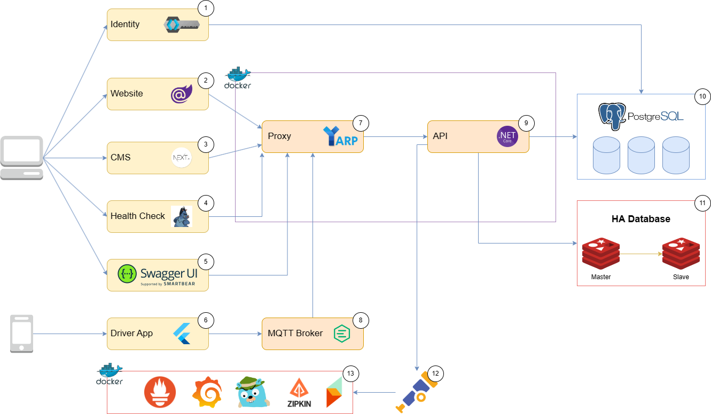

<table>
  <thead>
    <th>Name</th>
    <th>Usecase</th>
    <th>Technology</th>
  </thead>
  <tbody>
		<tr>
			<td><b>CMS</b></td>
			<td>
				<p align="justify">
					It will show the information of orders, vehicles, drivers, and 	other information related to the transportation process. It will also provide a dashboard for managers to monitor the transportation process.
				</p>
			</td>
			<td>
				<p align="justify">
					Next.js
				</p>
			</td>
		</tr>
		<tr>
			<td><b>Customer Website</b></td>
			<td>
				<p align="justify">
					It will provide pages for customers look up the information of orders. It will also provide a table for customers to see the history of orders.
				</p>
			</td>
			<td>
				<p align="justify">
					Blazor Server
				</p>
			</td>
		</tr>
		<tr>
			<td><b>Load Balancer</b></td>
			<td>
				<p align="justify">
					It will distribute the load to the available servers. It will also 	provide a dashboard for managers to monitor the load of the servers.
				</p>
			</td>
			<td>
				<p align="justify">
					YARP
				</p>
			</td>
    </tr>
		<tr>
			<td><b>Driver App</b></td>
			<td>
				<p align="justify">
					It provides a dashboard for drivers to monitor the transportation process. It will send the location of the vehicle to the server.
				</p>
			</td>
			<td>
				<p align="justify">
					Flutter
				</p>
			</td>
		</tr>
		<tr>
			<td><b>MQTT Broker</b></td>
			<td>
				<p align="justify">
					It will receive the location of the vehicle from the driver app and send it to the server.
				</p>
			</td>
			<td>
				<p align="justify">
					EMQX
				</p>
			</td>
		</tr>
		<tr>
			<td><b>API Server</b></td>
			<td>
				<p align="justify">
					It will receive the location of the vehicle from the MQTT Broker and send it to the database. It will also send the information of orders, vehicles, drivers, and other information related to the transportation process to the client.
				</p>
			</td>
			<td>
				<p align="justify">
					ASP.NET Core
				</p>
			</td>
		</tr>
		<tr>
			<td><b>Database</b></td>
			<td>
				<p align="justify">
					It will store the information of orders, vehicles, drivers, and other information related to the transportation process. We use Redis to cache the data.
				</p>
			</td>
			<td>
				<p align="justify">
					PostgreSQL, Redis
				</p>
			</td>
		</tr>
		<tr>
			<td><b>OpenTelemetry Collector</b></td>
			<td>
				<p align="justify">
					It will receive the telemetry data from the OpenTelemetry. It will send the telemetry data to the OpenTelemetry Processor.
				</p>
			</td>
			<td>
				<p align="justify">
					OpenTelemetry Collector
				</p>
			</td>
		</tr>
		<tr>
			<td><b>Health Check</b></td>
			<td>
				<p align="justify">
					It will check the health of the servers. It will send the health status of the servers to the Load Balancer.
				</p>
			</td>
			<td>
				<p align="justify">
					ASP.NET Core
				</p>
			</td>
		</tr>
		<tr>
			<td><b>Exporter</b></td>
			<td>
				<p align="justify">
					It will export the telemetry data to the OpenTelemetry Collector.
    		</p>
    		</td>
    		<td>
    			<p align="justify">
    				Grafana, Prometheus, Jaeger, Seq
    			</p>
    		</td>
		</tr>
  </tbody>
</table>

# Screenshots

## Website: Home page


## Website: Lookup page

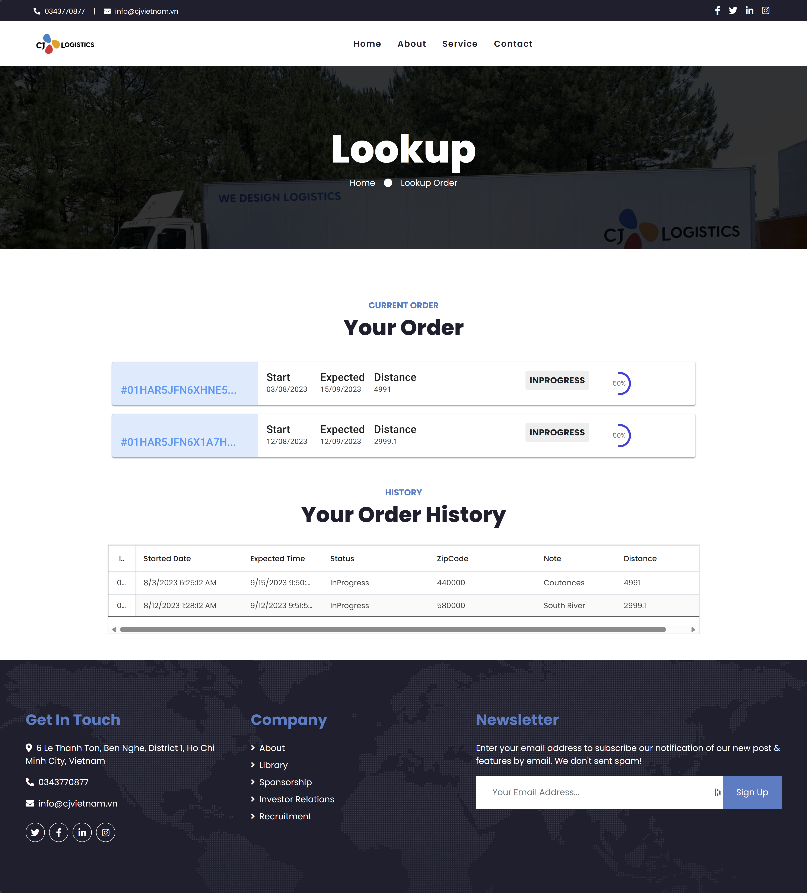

## Website: Contact page


## CMS: Login

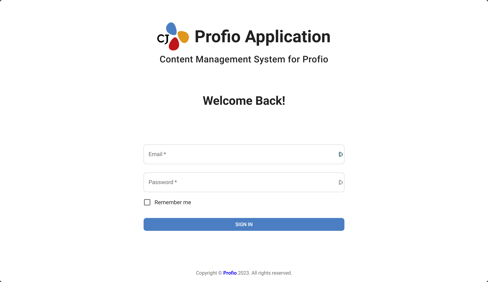

> **Note**
> If you want to see more, please visit the `Getting Started` section below.

# Getting Started

## 💻 Infrastructure

<ul>
	<li align="justify">
		<b><a href="https://nx.dev" target="_blank">Nx</a></b> - Nx is a set of extensible dev tools for monorepos.
	</li>
	<li align="justify">
		<b><a href="https://nodejs.org/en/" target="_blank">node.js</a></b> - Node.	js® is a JavaScript runtime built on Chrome's V8 JavaScript engine.
	</li>
	<li align="justify">
		<b><a href="https://www.npmjs.com/" target="_blank">npm</a></b> - npm is 	the package manager for the Node JavaScript platform.
	</li>
	<li align="justify">
		<b><a href="https://flutter.dev/" target="_blank">Flutter</a></b> - Flutter is Google's toolkit for creating sleek apps across mobile, web, and desktop from a single codebase.
	</li>
	<li align="justify">
		<b><a href="https://www.docker.com/" target="_blank">Docker (Kubernetes 	Enabled)</a></b> / <b><a href="https://podman.io/" target="_blank">Podman</a></b>
		 - Docker is an open platform for app development and management. Podman is a daemonless container engine for OCI Containers on Linux.
	</li>
	<li align="justify">
		<b><a href="https://kubernetes.io/vi/" target="_blank">Kubernetes</a></b> / <b><a href="https://azure.microsoft.com/en-us/products/kubernetes-service" target="_blank">AKS</a></b> / <b><a href="https://www.nomadproject.io/" target="_blank">Nomad</a></b> - The container orchestration platform for Kubernetes, AKS, and Nomad.
		</b>
	</li>
	<li align="justify">
		<b><a href="https://helm.sh/" target="_blank">Helm</a></b> - Helm is the best way to find, share, and use software built for Kubernetes.
	</li>
	<!-- tye -->
	<li align="justify">
		<b><a href="https://github.com/dotnet/tye" target="_blank">Tye</a></b> - Tye is a tool that makes developing, testing, and deploying applications easier.
	</li>
	<li align="justify">
		<b><a href="https://docs.microsoft.com/en-us/windows/wsl/install-win10" 	target="_blank">WSL 2 - Ubuntu OS</a></b> - WSL 2 enables running Linux ELF64 binaries on Windows.
	</li>
	<li align="justify">
		<b><a href="https://code.visualstudio.com/" target="_blank">Visual Studio Code</a></b> - Visual Studio Code is a code editor for modern web and cloud app development.
	</li>
	<li align="justify">
		<b><a href="https://www.jetbrains.com/rider/" target="_blank">JetBrains Rider</a></b> / <b><a href="https://visualstudio.microsoft.com/" target="_blank">Visual Studio 2022</a></b> - JetBrains Rider is a cross-platform .NET IDE built on IntelliJ and ReSharper. Visual Studio is Microsoft's IDE.
	</li>
	<li align="justify">
		<b><a href="https://dotnet.microsoft.com/" target="_blank">.NET Core 7</a></b> - .NET Framework and .NET Core, including ASP.NET and ASP.NET Core.
	</li>
	<li align="justify">
		<b><a href="https://https://www.python.org/" target="_blank">Python</a></b> - Python is a programming language that lets 	you work quickly and integrate systems more effectively.
	</li>
</ul>

## 📦 Services

<ul>
	<li align="justify">
		<b><a href="https://render.com/" target="_blank">Render</a></b> - Render is a unified platform for apps and websites with free SSL, global CDN, private networks, and Git auto-deploys.
	</li>
	<li align="justify">
		<b><a href="https://redislabs.com/" target="_blank">Redis Labs</a></b> - 	Redis Labs is the home of Redis, the world’s most popular in-memory 	database.
	</li>
	<li align="justify">
		<b><a href="https://azure.microsoft.com/" target="_blank">Azure</a></b> - 	Azure is an ever-expanding set of cloud computing services to help your organization meet its business challenges.
	</li>
	<li align="justify">
		<b><a href="https://www.cloudamqp.com/" target="_blank">CloudAMQP</a></b> 	- CloudAMQP automates RabbitMQ setup, running, and scaling on all major platforms.
	</li>
	<li align="justify">
		<b><a href="https://www.emqx.io/" target="_blank">EMQX</a></b> - EMQ X Broker is an open-source, scalable MQTT messaging broker for IoT, M2M, and mobile apps, handling millions of concurrent clients.
	</li>
	<li align="justify">
		<b><a href="https://cloud.google.com/" target="_blank">Google Cloud 	Platform</a></b> - Google Cloud Platform (GCP) is a suite of cloud services running on the same infrastructure as Google's user products like Search, Gmail, and YouTube.
	</li>
	<li align="justify">
		<b><a href="https://supabase.io/" target="_blank">Supabase</a></b> - Supabase is an open-source alternative to Firebase that adds real-time and RESTful APIs to your PostgreSQL database without any coding.
	</li>
	<li align="justify">
		<b><a href="https://www.twilio.com/" target="_blank">Twilio</a></b> - Twilio is a cloud communications platform as a service company based in San Francisco, California.
	</li>
</ul>

## 🛠️ Setup

First, clone the repository to your local machine:

```bash
git clone https://github.com/HutechCJ/ProfioApp.git
```

Next, navigate to the root directory of the project and install the dependencies:

```bash
npm install --force
```

## 🚀 Running the application

For the CMS, navigate to the `apps/cms` directory and run the following command:

```bash
npx nx serve cms --verbose
```

It will open the CMS in your browser at [http://localhost:4200/](http://localhost:4200/).

For the API, navigate to the `apps/Profio.Api` directory and run the following command:

```bash
npx nx serve Profio.Api --verbose
```

It will open the API in your browser at [http://localhost:9023/](http://localhost:5023/).

For the Proxy, navigate to the `apps/Profio.Proxy` directory and run the following command:

```bash
npx nx serve Profio.Proxy --verbose
```

It will open the Proxy in your browser at [http://localhost:7221/](http://localhost:7221/).

For the Web App, navigate to the `apps/Profio.Website` directory and run the following command:

```bash
npx nx serve Profio.Website --verbose
```

It will open the Web App in your browser at [http://localhost:5272/](http://localhost:5272/).

For the documentation, navigate to the `apps/docs` directory and run the following command:

```bash
npx nx serve docs --verbose
```

It will open the documentation in your browser at [http://localhost:3000/](http://localhost:3000/).

For the Driver App, navigate to the `apps/profio-app` directory and run the following command:

```bash
npx nx serve profio-app --verbose
```

For running all applications, navigate to the root directory of the project and run the following command:

```bash
npx nx run-many --target=serve --all
```

For running by `tye`, navigate to the root directory of the project and run the following command:

```bash
tye run --dashboard
```

> **Warning**
> All connections strings will be unavailable when this repository is public.

## 🐳 Running services with Docker

For running all external services, navigate to the root directory of the project and run the following command:

```bash
docker-compose up -d
```

For running `api` & `proxy`, navigate to the root directory of the project and run the following command:

```bash
docker pull ghcr.io/hutechcj/profio-api:latest
docker pull ghcr.io/hutechcj/profio-proxy:latest
docker run -d -p 5023:80 ghcr.io/hutechcj/profio-api:latest
docker run -d -p 7221:80 ghcr.io/hutechcj/profio-proxy:latest
```

# API development

<p align="justify">
	We use Clean Architecture for the API development. You can read more about Clean Architecture <a href="https://docs.microsoft.com/en-us/dotnet/architecture/modern-web-apps-azure/common-web-application-architectures#clean-architecture" target="_blank">here</a>. The CQRS and Mediator patterns are also used in the API development. We also implement the Options Pattern to read the configuration settings.You can read more about CQRS <a href="https://docs.microsoft.com/en-us/azure/architecture/patterns/cqrs" target="_blank">here</a>, Mediator <a href="https://refactoring.guru/design-patterns/mediator" target="_blank">here</a> and Options Pattern <a href="https://learn.microsoft.com/en-us/aspnet/core/fundamentals/configuration/options?view=aspnetcore-8.0" target="_blank">here</a>.
</p>

<figure>
	
	<figcaption>
		<p align="center">
			<b>Clean Architecture</b>
		</p>
	</figcaption>
</figure>

<figure>
	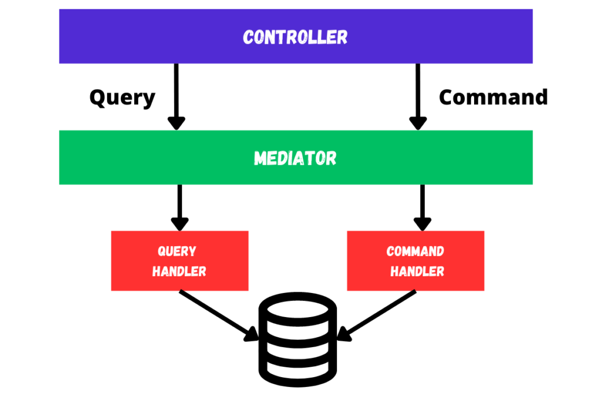
	<figcaption>
		<p align="center">
			<b>CQRS with Mediator</b>
		</p>
	</figcaption>
</figure>

# Open API


> **Note**
> We have implemented Redoc to generate the API documentation.

# Dependency Graph

You can see the dependency graph of the project by running the following command:

```bash
npx nx dep-graph
```

Here is the dependency graph of the project, generated by Nx:

<p align="center">
	
</p>

# CI/CD

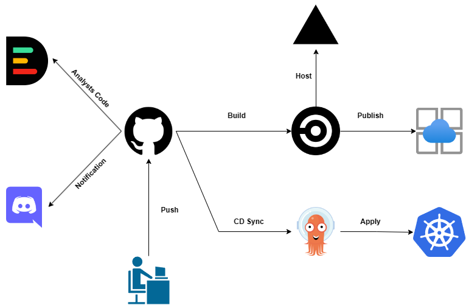

# External services

## 📦 Container Management

<p align="justify">
	We used the <b>Portainer</b> service to manage the containers. Portainer is an open-source lightweight management UI which allows you to easily manage your Docker environments.
</p>

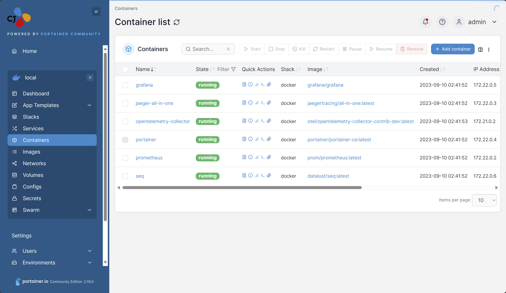

## 🧑‍⚕️ Health Check

<p align="justify">
	For the API health check, We have used the <b>ASP.NET Core Health Checks</b> library to monitor the health of the application. The health check endpoint is exposed at <b>/hc</b> or <b>/hc-ui</b> and can be accessed via HTTP GET.
</p>

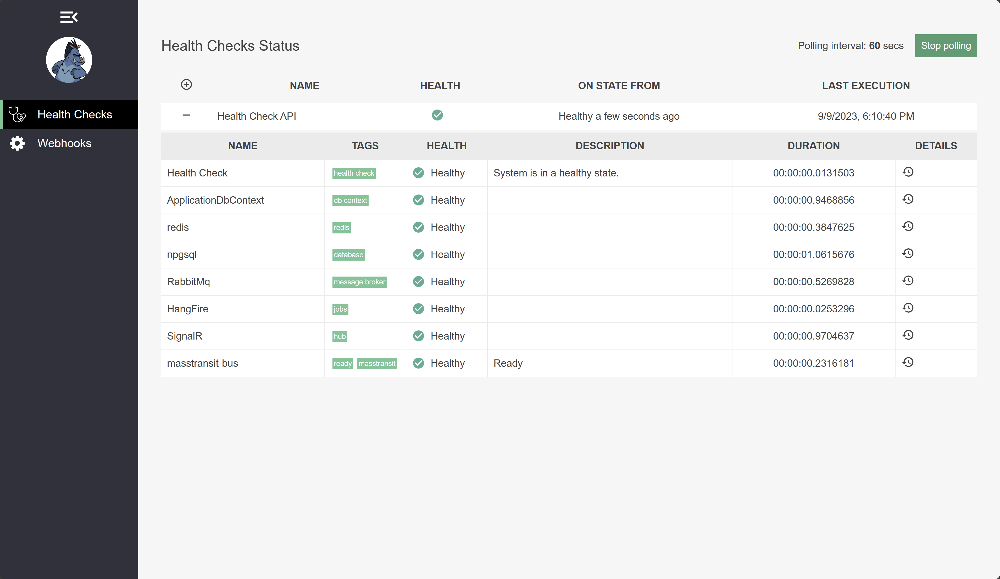

## 📊 Monitoring

<p align="justify">
For the monitoring service, We have used the <b>Prometheus</b> and <b>Grafana</b> services to collect and analyze metrics.
</p>

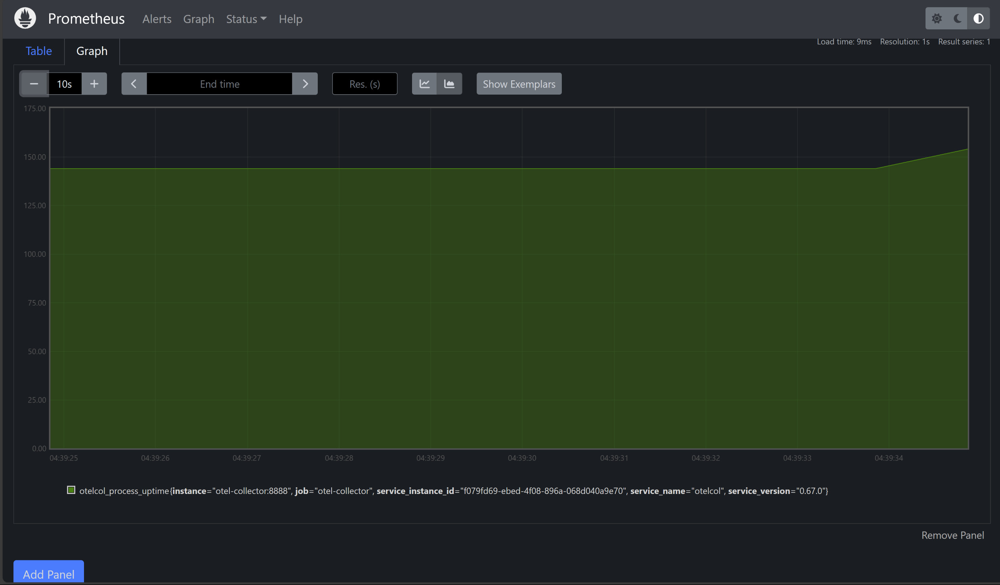

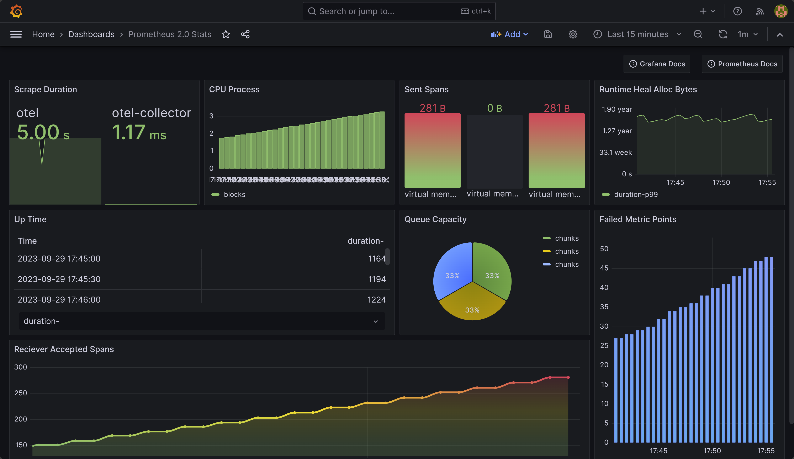

## 📈 Tracing

<p align="justify">
For the tracing service, We have used the <b>Jaeger</b> service to collect and analyze traces.
</p>

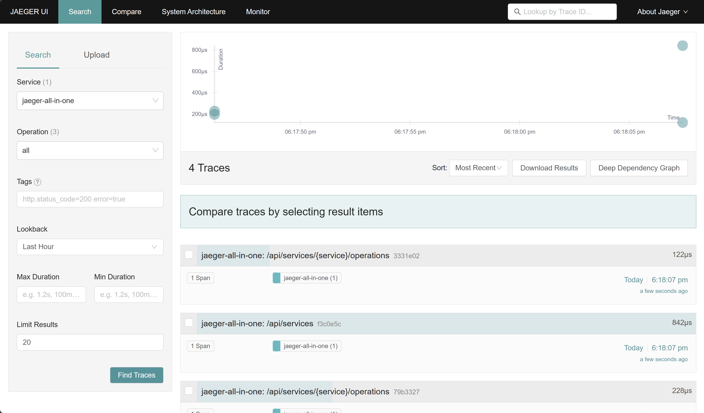

## 📝 Logging

<p align="justify">
We set up the <b>seq</b> service to collect and analyze logs.
</p>

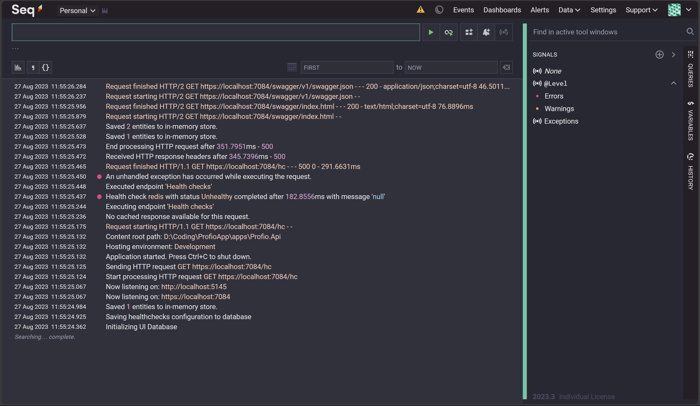

## 📦 Database Management

<p align="justify">
For the database management service, We have used the <b>PgAdmin</b> service to manage the PostgreSQL database.
</p>

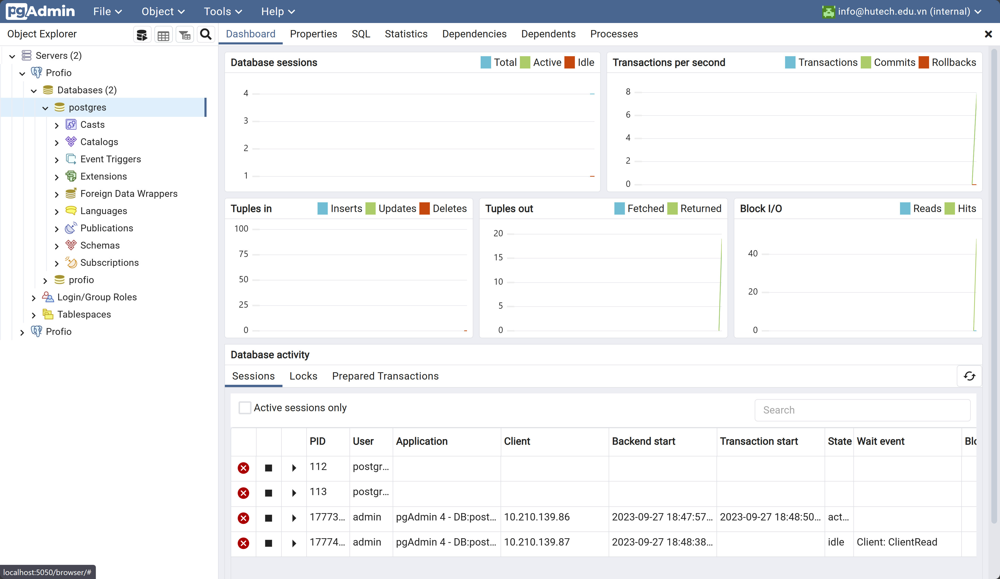

## 🔒 Identity Server

<p align="justify">
For the identity server, We have used the <b>Keycloak</b> service to manage the users. With SSO, you can log in to multiple applications with a single account. You can also use Keycloak to manage the users of your applications.
</p>

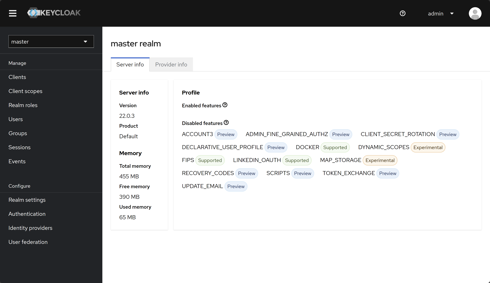

# Contributing

Wanna be here? [Contribute](./.github/CONTRIBUTING.md).

- Fork this repository.
- Create your new branch with your feature: `git checkout -b my-feature`.
- Commit your changes: `git commit -am 'feat: My new feature'`.
- Push to the branch: `git push origin my-feature`.
- Submit a pull request 👌.

# Contributors

Thanks goes to these wonderful people ([emoji key](https://allcontributors.org/docs/en/emoji-key))

<table>
	<tr>
		<td align="center" valign="top">
				
        <br>
        <a href="https://github.com/foxminchan">Xuan Nhan</a>
        <p>
          <a href="https://github.com/HutechCJ/ProfioApp/commits?author=foxminchan" title="Developer">💻</a>
          <a href="#docs" title="Documentation">📖</a>
          <a href="#infra" title="Infrastructure">🚇</a>
          <a href="#tool" title="Tools">🔧</a>
					<a href="#mentoring" title="Mentoring">🧑‍🏫</a>
        </p>
		</td>
		<td align="center" valign="top">
				
        <br>
        <a href="https://github.com/Slimaeus">Hong Thai</a>
        <p>
          <a href="https://github.com/HutechCJ/ProfioApp/commits?author=Slimaeus" title="Developer">💻</a>
          <a href="#infra" title="Infrastructure">🚇</a>
					<a href="#projectManagement" title="Project Management">📆</a>
					<a href="#maintenance" title="Maintenance">🚧</a>
					<a href="#review" title="Reviewed Pull Requests">👀</a>
        </p>
		</td>
		<td align="center" valign="top">
				
        <br>
        <a href="https://github.com/nhonvo">Truong Nhon</a>
        <p>
          <a href="https://github.com/HutechCJ/ProfioApp/commits?author=nhonvo" title="Developer">💻</a>
          <a href="#ideas" title="Ideas, Planning, & Feedback">🤔</a>
					<a href="#data" title="Data">🔣</a>
					<a href="#business" title="Business Development">💼</a>
        </p>
		</td>
		<td align="center" valign="top">
				
        <br>
        <a href="https://github.com/fiezt1492">Tien Dat</a>
        <p>
          <a href="https://github.com/HutechCJ/ProfioApp/commits?author=fiezt1492" title="Developer">💻</a>
          <a href="#design" title="Design">🎨</a>
					<a href="#content" title="Content">🖋</a>
					<a href="#maintenance" title="Maintenance">🚧</a>
        </p>
		</td>
		<td align="center" valign="top">
				
        <br>
        <a href="https://github.com/MeiCloudie">Thuc Van</a>
        <p>
          <a href="https://github.com/HutechCJ/ProfioApp/commits?author=MeiCloudie" title="Developer">💻</a>
          <a href="#design" title="Design">🎨</a>
					<a href="#content" title="Content">🖋</a>
					<a href="#talk" title="Talks">📢</a>
        </p>
		</td>
	</tr>
</table>

# Support and Organization

<p align="center">
	<a href="https://cjvietnam.vn/" target="_blank">
		
	</a>
	<a href="https://hutech.edu.vn/" target="_blank">
		
	</a>
</p>

# License

This project is made available under the MIT license. See the [LICENSE](LICENSE) file for details
