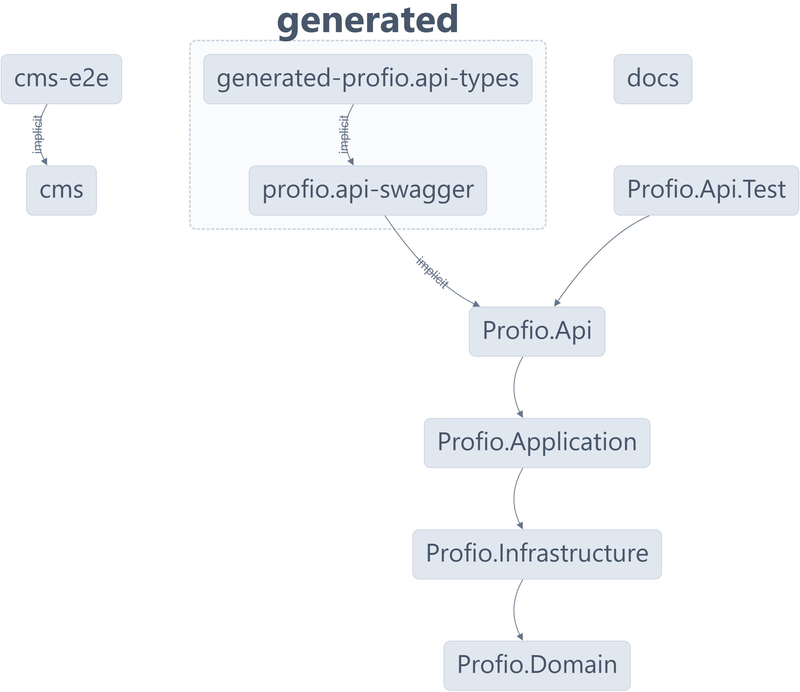

<h1 align="center">
	<a name="readme-top"></a>
	<p></p>
Profio Application
</h1>

<p align="center">
	Profio Application is a monorepo project built with <a href="https://nx.dev/">Nx</a> technology. It is a set of extensible dev tools for monorepos, which helps you develop like Google, Facebook, and Microsoft.
</p>

# Overview

<p align="justify">
	Profio - the symbol of professionalism in transportation management. Whether you need a solution for managing a fleet of vehicles or ships, Profio provides a powerful tool, optimizing and simplifying the process, ensuring every movement is quick, safe, and efficient
</p>

# Getting Started

## 💻 Infrastructure

- **[Nx](https://nx.dev)** - Nx is a set of extensible dev tools for monorepos, which helps you develop like Google, Facebook, and Microsoft.
- **[node.js](https://nodejs.org/en/)** - Node.js® is a JavaScript runtime built on Chrome's V8 JavaScript engine.
- **[npm](https://www.npmjs.com/)** - npm is the package manager for the Node JavaScript platform.
- **[.NET Core](https://dotnet.microsoft.com/)** - .NET is a developer platform with tools and libraries for building any type of app, including web, mobile, desktop, games, IoT, cloud, and microservices.
- **[Docker (Kubernetes Enabled)](https://www.docker.com/)** - Docker is an open platform for developing, shipping, and running applications.

## 📦 Services

- **[Render](https://render.com/)** - Render is a unified platform to build and run all your apps and websites with free SSL, global CDN, private networks and auto deploys from Git.
- **[Redis Labs](https://redislabs.com/)** - Redis Labs is the home of Redis, the world’s most popular in-memory database, and commercial provider of Redis Enterprise.
- **[Azure](https://azure.microsoft.com/)** - Azure is an ever-expanding set of cloud computing services to help your organization meet its business challenges.
- **[CloudAMQP](https://www.cloudamqp.com/)** - CloudAMQP automates every part of setup, running and scaling of RabbitMQ clusters. Available on all major cloud and application platforms.

## 🛠️ Setup

First, clone the repository to your local machine:

```bash
git clone https://github.com/HutechCJ/ProfioApp.git
```

Next, navigate to the root directory of the project and install the dependencies:

```bash
npm install --force
```

## 🚀 Running the application

For the CMS, navigate to the `apps/cms` directory and run the following command:

```bash
npx nx serve cms
```

For the API, navigate to the `apps/Profio.Api` directory and run the following command:

```bash
npx nx serve Profio.Api
```

For running all applications, navigate to the root directory of the project and run the following command:

```bash
npx nx run-many --target=serve --all
```

## 🧪 Testing the application

For the CMS, navigate to the `apps/cms-e2e` directory and run the following command:

```bash
npx nx e2e cms-e2e
```

For the API, navigate to the `apps/Profio.Api` directory and run the following command:

```bash
npx nx test Profio.Api
```

## 🐳 Running services with Docker

For running all services, navigate to the root directory of the project and run the following command:

```bash
docker-compose up -d
```

# Dependency Graph

You can see the dependency graph of the project by running the following command:

```bash
npx nx dep-graph
```

Here is the dependency graph of the project:

<p align="center">
	
</p>

# License

This project is licensed under the MIT License - see the [LICENSE](LICENSE) file for details
