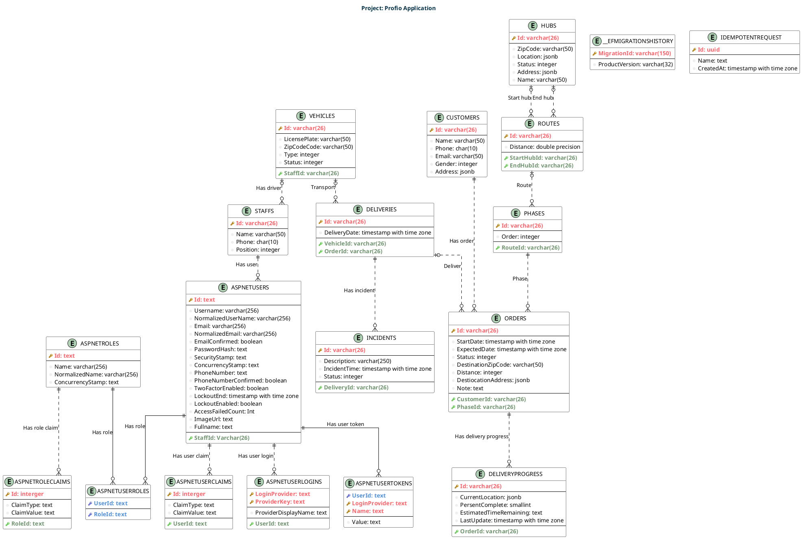

# Entity Description

## Identity Schema

ASP.NET Core Identity is an API, which provides a framework for implementing authentication and authorization in .NET Core applications. It is an open-source replacement for the previous ASP.NET Membership system. ASP.NET Core Identity allows you to add login features to your application and makes it easy to customize data about the logged-in user.

ASP.NET Core Identity uses a SQL Server database to store user names, passwords, and profile data. The schema for the database is automatically created when you create the project. The schema is based on the ASP.NET Core Identity Entity Framework Core Code First default schema. The schema is designed to support the default ASP.NET Core Identity UI, which you can scaffold into your project.

The ASP.NET Core Identity schema is designed to support the default ASP.NET Core Identity UI, which you can scaffold into your project. The schema is based on the ASP.NET Core Identity Entity Framework Core Code First default schema. The schema is automatically created when you create the project.

Learn more about ASP.NET Core Identity schema at <a href="https://learn.microsoft.com/en-us/aspnet/core/security/authentication/identity-configuration?view=aspnetcore-8.0#aspnet-core-identity-schema">ASP.NET Core Identity schema</a>.

## Business Schema

### STAFFS Entity

- **Description:** The "STAFFS" entity represents the staff members involved in logistics operations. These staff members play crucial roles in the management and execution of logistics tasks, including drivers, warehouse personnel, and administrative staff.
- **Attributes:**
  - `Id`: Primary Key - A unique identifier for each staff member, typically in the form of a varchar(26).
  - `Name`: (varchar(50)) - The full name of the staff member, allowing for up to 50 characters.
  - `Phone`: (char(10)) - The contact phone number of the staff member, typically limited to 10 characters.
  - `Position`: (integer) - An integer code representing the staff member's position or role within the logistics team.

### VEHICLES Entity

- **Description:** The "VEHICLES" entity manages the fleet of vehicles used for transportation within the logistics system. These vehicles serve as essential assets for carrying out deliveries and shipments.
- **Attributes:**
  - `Id`: Primary Key - A unique identifier for each vehicle, typically in the form of a varchar(26).
  - `LicensePlate`: (varchar(50)) - The license plate number of the vehicle, allowing for up to 50 characters.
  - `ZipCodeCode`: (varchar(50)) - The zip code associated with the vehicle's location or base, allowing for up to 50 characters.
  - `Type`: (integer) - An integer code indicating the type or category of the vehicle, such as truck, van, motorcycle, etc.
  - `Status`: (integer) - An integer code representing the operational status of the vehicle, which can include values such as operational, under maintenance, or offline.
  - `StaffId`: Foreign Key - References the staff member responsible for the vehicle, typically linking to the "STAFFS" entity using the staff member's unique identifier.

### DELIVERIES Entity

- **Description:** The "DELIVERIES" entity tracks the details of individual deliveries, including delivery dates, associated vehicles, and orders. It serves as a central repository for monitoring and managing the progress of each delivery.
- **Attributes:**
  - `Id`: Primary Key - A unique identifier for each delivery, typically in the form of a varchar(26).
  - `DeliveryDate`: (timestamp with time zone) - The date and time when the delivery was made, recorded with time zone information.
  - `VehicleId`: Foreign Key - References the vehicle used for the delivery, linking to the "VEHICLES" entity using the vehicle's unique identifier.
  - `OrderId`: Foreign Key - References the order associated with the delivery, typically linking to the "ORDERS" entity using the order's unique identifier.

### ORDERS Entity

- **Description:** The "ORDERS" entity manages customer orders within the logistics system. It encompasses essential order-related details, including order initiation dates, expected delivery times, and order statuses.
- **Attributes:**
  - `Id`: Primary Key - A unique identifier for each order, typically in the form of a varchar(26).
  - `StartDate`: (timestamp with time zone) - The date and time when the order was initially placed by the customer, recorded with time zone information.
  - `ExpectedDate`: (timestamp with time zone) - The expected delivery date and time for the order, recorded with time zone information.
  - `Status`: (integer) - An integer code representing the current status of the order, allowing for tracking of its progress, e.g., processing, delivered.
  - `DestinationZipCode`: (varchar(50)) - The zip code of the order's intended destination, allowing for up to 50 characters.
  - `Distance`: (integer) - An integer indicating the estimated distance from the source to the destination for the order.
  - `DestiocationAddress`: (jsonb) - JSON data containing comprehensive address details of the order's destination, accommodating various address components.
  - `Note`: (text) - A text-based field for additional notes or comments related to the order, providing space for more detailed information.
  - `CustomerId`: Foreign Key - References the customer who placed the order, typically linking to the "CUSTOMERS" entity using the customer's unique identifier.
  - `PhaseId`: Foreign Key - References the current phase of the order, often linking to the "PHASES" entity using the phase's unique identifier.

### CUSTOMERS Entity

- **Description:** The "CUSTOMERS" entity represents the customers who interact with the logistics system by placing orders. It encompasses customer-specific details necessary for communication and order management.
- **Attributes:**
  - `Id`: Primary Key - A unique identifier for each customer, typically in the form of a varchar(26).
  - `Name`: (varchar(50)) - The full name of the customer, allowing for up to 50 characters.
  - `Phone`: (char(10)) - The contact phone number of the customer, typically limited to 10 characters.
  - `Email`: (varchar(50)) - The email address of the customer, enabling electronic communication.
  - `Gender`: (integer) - An integer code representing the gender of the customer, allowing for categorization.
  - `Address`: (jsonb) - JSON data containing detailed address information for the customer, accommodating various address components such as street, city, and postal code.

### DELIVERYPROGRESS Entity

- **Description:** The "DELIVERYPROGRESS" entity serves as a crucial tool for monitoring and tracking the progress of deliveries. It provides real-time information about delivery location, completion percentage, and estimated time remaining.
- **Attributes:**
  - `Id`: Primary Key - A unique identifier for each delivery progress record, typically in the form of a varchar(26).
  - `CurrentLocation`: (jsonb) - JSON data representing the current geographical location of the delivery, including latitude and longitude coordinates.
  - `PersentComplete`: (smallint) - A small integer representing the percentage of delivery completion, facilitating progress visualization.
  - `EstimatedTimeRemaining`: (text) - A text-based field indicating the estimated time remaining for the delivery, allowing for descriptive estimates.
  - `LastUpdate`: (timestamp with time zone) - The timestamp of the last progress update, recorded with time zone information.
  - `OrderId`: Foreign Key - References the order associated with the delivery progress record, typically linking to the "ORDERS" entity using the order's unique identifier.

### INCIDENTS Entity

- **Description:** The "INCIDENTS" entity records and manages incidents that may occur during the course of logistics operations. It serves as a repository for incident-related details and their impact on deliveries.
- **Attributes:**
  - `Id`: Primary Key - A unique identifier for each incident, typically in the form of a varchar(26).
  - `Description`: (varchar(250)) - A brief but informative description of the incident, allowing for up to 250 characters.
  - `IncidentTime`: (timestamp with time zone) - The timestamp indicating when the incident occurred, recorded with time zone information.
  - `Status`: (integer) - An integer code representing the current status or resolution status of the incident, facilitating incident tracking.
  - `DeliveryId`: Foreign Key - References the delivery affected by the incident, typically linking to the "DELIVERIES" entity using the delivery's unique identifier.

### PHASES Entity

- **Description:** The "PHASES" entity manages the various phases or stages within an order's lifecycle. It helps organize and track the progression of orders through different stages.
- **Attributes:**
  - `Id`: Primary Key - A unique identifier for each phase, typically in the form of a varchar(26).
  - `Order`: (integer) - An integer indicating the order or sequence of the phase within an order, allowing for precise ordering of phases.
  - `RouteId`: Foreign Key - References the route associated with the phase, typically linking to the "ROUTES" entity using the route's unique identifier.

### ROUTES Entity

- **Description:** The "ROUTES" entity defines specific routes used by vehicles within the logistics system. It includes details such as distance covered, helping optimize transportation.
- **Attributes:**
  - `Id`: Primary Key - A unique identifier for each route, typically in the form of a varchar(26).
  - `Distance`: (double precision) - A double-precision number indicating the distance covered by the route, allowing for precise measurements.
  - `StartHubId`: Foreign Key - References the hub where the route starts, typically linking to the "HUBS" entity using the hub's unique identifier.
  - `EndHubId`: Foreign Key - References the hub where the route ends, typically linking to the "HUBS" entity using the hub's unique identifier.

### HUBS Entity

- **Description:** The "HUBS" entity represents hubs or locations within the logistics network. These hubs serve as key points for organizing and managing logistics operations, including distribution centers, warehouses, and pick-up/delivery points.
- **Attributes:**
  - `Id`: Primary Key - A unique identifier for each hub, typically in the form of a varchar(26).
  - `ZipCode`: (varchar(50)) - The zip code associated with the hub's geographical location, allowing for up to 50 characters.
  - `Location`: (jsonb) - JSON data representing the precise geographical coordinates (latitude and longitude) of the hub.
  - `Status`: (integer) - An integer code indicating the operational status of the hub, providing insights into whether the hub is operational, inactive, or undergoing maintenance.
  - `Address`: (jsonb) - JSON data containing comprehensive address details of the hub, accommodating various address components.
  - `Name`: (varchar(50)) - The name or identifier of the hub, typically used for easy reference and identification.

## Other Schema

### \_\_EFMigrationsHistory Entity

- **Description:** The "\_\_EFMigrationsHistory" entity is a system table that stores details about the migrations applied to the database. It is automatically created when you create the project.
  - **Attributes:**
    - `MigrationId`: (varchar(150)) - The unique identifier of the migration, allowing for up to 150 characters.
    - `ProductVersion`: (varchar(32)) - The version of the product, allowing for up to 32 characters.

### IDEMPOTENTREQUEST Entity

- **Description:** The "IDEMPOTENTREQUEST" entity is a system table that stores details about the idempotent requests applied to the database. It is automatically created when you create the project.
  - **Attributes:**
    - `Id`: (uuid) - The unique identifier of the idempotent request.
    - `Name`: (text) - The name of the idempotent request.
    - `CreatedAt`: (timestamp with time zone) - The timestamp of the idempotent request, recorded with time zone information.

