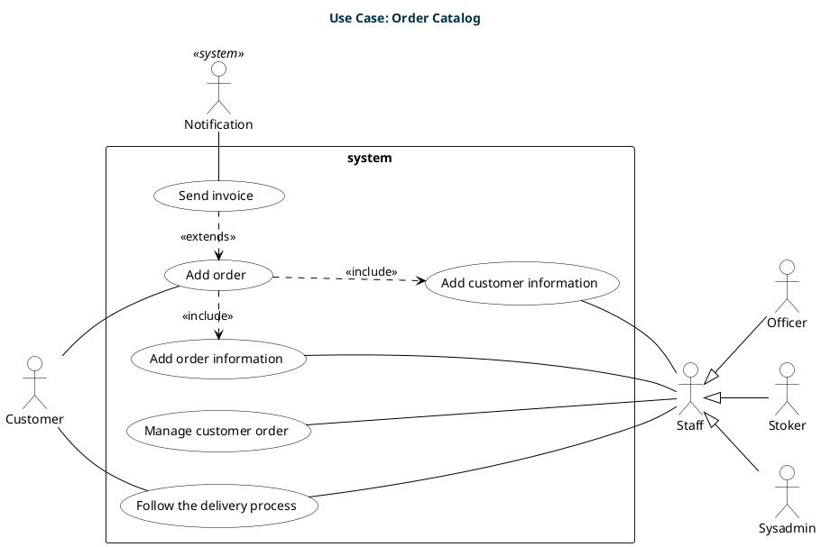
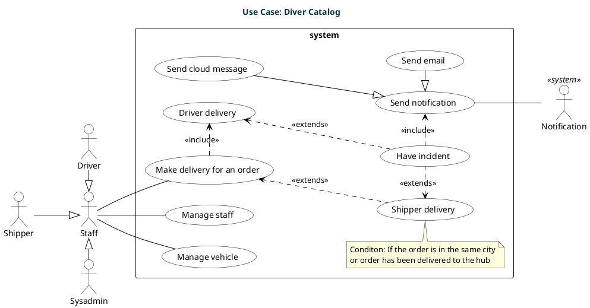
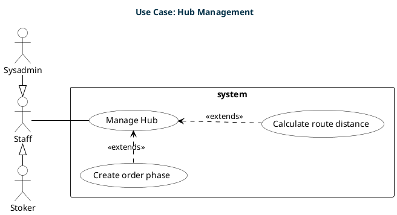
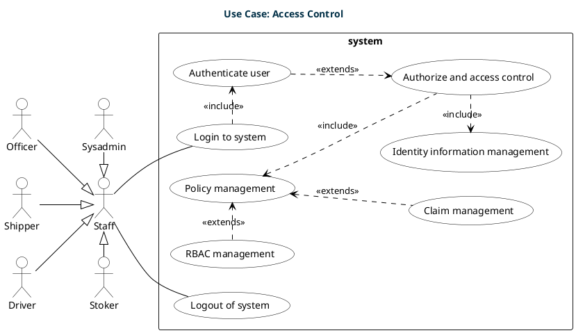

# Usecase View

## Overview

	The use case view is a visual representation of the interactions of actors with a system. It is a collection of use cases, actors, and their relationships. The use case view is used to describe the functional requirements of the system. It is also used to capture the requirements of a system, that is, what a system is supposed to do. The use case view is also used to capture the functional requirements of a system, that is, what a system is supposed to do.

## Order Catalog

**Overview**

	The Customer Order Management System is a critical component of our organization's operations. It enables smooth interactions among various actors, including Customers, Staff, Officers, Stokers, and Sysadmins. The primary objective of this system is to efficiently handle customer orders, ensuring a streamlined process from order creation to delivery.

**Use Case Scenarios**

<table>
    <tr>
        <th>Use Case Scenario</th>
        <th>Actor</th>
        <th>Description</th>
        <th>Trigger</th>
        <th>Preconditions</th>
        <th>Postconditions</th>
    </tr>
    <tr>
        <td>Adding an Order</td>
        <td>Customer</td>
        <td>Customers initiate the process by placing a new order into the system, triggering subsequent order-related activities.</td>
        <td>The customer's intention to purchase products/services from our organization.</td>
        <td>Customers must be authenticated and have access to the system.</td>
        <td>The system records the new order, making it ready for further processing.</td>
    </tr>
    <tr>
        <td>Adding Customer Information</td>
        <td>Staff</td>
        <td>Staff members add or update customer information as part of order management, ensuring accurate records.</td>
        <td>Creation of a new customer profile or the need to update existing contact and billing information.</td>
        <td>Staff members must have proper authorization to access and modify customer information.</td>
        <td>Customer information is kept up-to-date and available for order processing.</td>
    </tr>
    <tr>
        <td>Adding Order Information</td>
        <td>Staff</td>
        <td>Staff members update order-specific details, including product quantities, specifications, and delivery preferences.</td>
        <td>Changes or modifications requested by the customer or necessary for order fulfillment.</td>
        <td>Staff must have appropriate authorization to access and modify order information.</td>
        <td>Order details accurately reflect the customer's preferences and are ready for processing.</td>
    </tr>
    <tr>
        <td>Following the Delivery Process</td>
        <td>Staff, Customer</td>
        <td>Both staff and customers can track the progress of an order's delivery process, ensuring transparency and timely updates.</td>
        <td>The desire to monitor order status, location, and expected delivery time.</td>
        <td>The order must be in the delivery phase, and relevant tracking information should be available.</td>
        <td>Users have real-time insights into the order's location and estimated delivery time.</td>
    </tr>
    <tr>
        <td>Managing Customer Orders</td>
        <td>Staff</td>
        <td>Staff members manage and oversee the entire customer order lifecycle, from order creation to successful delivery.</td>
        <td>Various actions, such as order approval, cancellation, or rescheduling, necessitate active management.</td>
        <td>Staff must have appropriate authorization and responsibilities for order management.</td>
        <td>Orders are processed efficiently, leading to customer satisfaction.</td>
    </tr>
		<tr>
			<td>Send Invoice (Included in "Adding an Order")</td>
			<td>Notification</td>
			<td>The "Send invoice" use case is initiated as part of adding an order and is responsible for sending an invoice to the customer.</td>
			<td>Order creation requires sending an invoice to the customer.</td>
			<td>This use case does not specify explicit preconditions.</td>
			<td>An invoice is sent to the customer, allowing for payment processing.</td>
		</tr>
</table>

## Driver Catalog

**Overview**

	The Delivery Management System plays a pivotal role in our organization's logistics and delivery operations. It involves the coordination and management of various actors, including Staff, Drivers, Shippers, Sysadmins, and the Notification system. The primary objective of this system is to ensure efficient and reliable delivery of orders to customers while addressing any exceptional circumstances that may arise during the delivery process.

**Use Case Scenarios**

<table>
    <tr>
        <th>Use Case Scenario</th>
        <th>Actor</th>
        <th>Description</th>
        <th>Trigger</th>
        <th>Preconditions</th>
        <th>Postconditions</th>
    </tr>
    <tr>
        <td>Managing Staff</td>
        <td>Staff</td>
        <td>Staff members manage the workforce involved in delivery operations, including hiring, training, and scheduling.</td>
        <td>The need for staff management to ensure the availability of resources.</td>
        <td>Staff must have the appropriate permissions and access to staff management tools.</td>
        <td>Staff resources are effectively managed to support delivery operations.</td>
    </tr>
    <tr>
        <td>Managing Vehicles</td>
        <td>Staff</td>
        <td>Staff members oversee the management and maintenance of delivery vehicles, ensuring they are in optimal condition.</td>
        <td>Vehicle management needs arising from routine maintenance, repairs, or additions to the fleet.</td>
        <td>Staff must have access to vehicle management tools and authorization.</td>
        <td>Delivery vehicles are maintained and available for deliveries as needed.</td>
    </tr>
    <tr>
        <td>Making Delivery for an Order</td>
        <td>Staff</td>
        <td>Staff members coordinate the delivery process for customer orders, assigning drivers or shippers as required.</td>
        <td>Customer orders ready for delivery.</td>
        <td>Staff must have access to order management tools and authorization.</td>
        <td>Orders are assigned for delivery, initiating the delivery process.</td>
    </tr>
    <tr>
        <td>Handling Delivery Incidents</td>
        <td>Driver, Shipper</td>
        <td>Drivers and shippers handle unexpected incidents during delivery, such as delays or issues with delivery locations.</td>
        <td>Incidents occurring during the delivery process.</td>
        <td>Delivery incidents have occurred.</td>
        <td>Relevant parties are notified about the incident, allowing for appropriate actions to be taken.</td>
    </tr>
    <tr>
        <td>Send Notification (Included in "Handling Delivery Incidents")</td>
        <td>Notification</td>
        <td>The "Send notification" use case is initiated as part of handling delivery incidents and is responsible for sending notifications to relevant parties regarding the incident.</td>
        <td>Incident handling requires notifying relevant parties.</td>
        <td>This use case does not specify explicit preconditions.</td>
        <td>Notifications are sent to inform relevant parties about the incident, allowing for appropriate actions to be taken.</td>
    </tr>
</table>

## Hub Management

**Overview**

	The Hub Management and Route Optimization system is a crucial component of our logistics and delivery operations. It focuses on the coordination and management of various actors, including Staff, Sysadmins, and Stokers. The primary objective of this system is to efficiently manage our delivery hubs and optimize delivery routes to ensure timely and cost-effective order fulfillment.

**Use Case Scenarios**

<table>
    <tr>
        <th>Use Case Scenario</th>
        <th>Actor</th>
        <th>Description</th>
        <th>Trigger</th>
        <th>Preconditions</th>
        <th>Postconditions</th>
    </tr>
    <tr>
        <td>Managing Hub</td>
        <td>Staff</td>
        <td>Staff members oversee the management of delivery hubs, ensuring that they are well-organized, adequately staffed, and equipped to handle order processing efficiently.</td>
        <td>The need for hub management to support order processing and fulfillment.</td>
        <td>Staff must have the appropriate permissions and access to hub management tools.</td>
        <td>Hubs are effectively managed, enabling smooth order processing and delivery operations.</td>
    </tr>
    <tr>
        <td>Calculate Route Distance (Extends "Manage Hub")</td>
        <td>Staff</td>
        <td>Staff members use route optimization algorithms to calculate the distances between hubs and delivery locations, helping to minimize transportation costs and delivery times.</td>
        <td>The need to optimize delivery routes for cost-efficiency and timely deliveries.</td>
        <td>This use case extends the "Manage Hub" use case, indicating that hub management is already in progress.</td>
        <td>Optimized delivery routes are calculated, contributing to cost savings and improved delivery performance.</td>
    </tr>
    <tr>
        <td>Create Order Phase (Extends "Manage Hub")</td>
        <td>Staff</td>
        <td>During the order creation phase, staff members consider hub availability and capacity to ensure that orders are assigned to hubs efficiently.</td>
        <td>The initiation of the order creation process.</td>
        <td>This use case extends the "Manage Hub" use case, indicating that hub management activities are already underway.</td>
        <td>Orders are assigned to hubs based on their availability and capacity, optimizing order distribution.</td>
    </tr>
</table>

## Access Control

**Overview**

	The User Authentication, Authorization, and Access Control system is a critical component of our organization's operational infrastructure. It involves multiple actors, including Staff, Sysadmins, Stokers, Drivers, Shippers, and Officers. The primary objective of this system is to ensure secure access to our systems and applications, controlling what actions users can perform based on their roles and permissions.

**Use Case Scenarios**

<table>
    <tr>
        <th>Use Case Scenario</th>
        <th>Actor</th>
        <th>Description</th>
        <th>Trigger</th>
        <th>Preconditions</th>
        <th>Postconditions</th>
    </tr>
    <tr>
        <td>Login to System</td>
        <td>Staff</td>
        <td>Staff members initiate the system by logging in, providing their credentials for authentication.</td>
        <td>Staff members' need to access system functions and data.</td>
        <td>Staff members must have valid accounts and credentials.</td>
        <td>Authenticated staff members gain access to the system, enabling them to perform authorized tasks.</td>
    </tr>
    <tr>
        <td>Authenticate User (Included in "Login to System")</td>
        <td>System (Authentication module)</td>
        <td>The authentication module verifies staff members' provided credentials during the login process.</td>
        <td>Staff members' login attempts.</td>
        <td>Staff members must initiate the login process.</td>
        <td>Authenticated users gain access to the system if their credentials are valid.</td>
    </tr>
    <tr>
        <td>Authorize and Access Control (Extends "Authenticate User")</td>
        <td>System (Authorization and Access Control module)</td>
        <td>The Authorization and Access Control module verifies staff members' roles and permissions to determine their access privileges within the system.</td>
        <td>Successful user authentication.</td>
        <td>Users must be successfully authenticated.</td>
        <td>Authorized users gain access to specific system functions and data based on their roles and permissions.</td>
    </tr>
    <tr>
        <td>Policy Management (Included in "Authorize and Access Control")</td>
        <td>Staff</td>
        <td>Staff members manage access control policies and configurations to define who can access specific resources and actions within the system.</td>
        <td>The need to modify or update access control policies.</td>
        <td>Staff members must have authorization to manage access control policies.</td>
        <td>Access control policies are updated and enforced within the system.</td>
    </tr>
    <tr>
        <td>Identity Information Management (Included in "Authorize and Access Control")</td>
        <td>Staff</td>
        <td>Staff members manage user identity information, including roles, permissions, and personal data.</td>
        <td>The need to update user profiles or roles.</td>
        <td>Staff members must have authorization to manage identity information.</td>
        <td>User identity information is updated, ensuring accurate access control.</td>
    </tr>
    <tr>
        <td>RBAC Management (Extends "Policy Management")</td>
        <td>Staff</td>
        <td>Staff members manage Role-Based Access Control (RBAC) policies to define roles and their associated permissions.</td>
        <td>The need to define or modify roles and permissions.</td>
        <td>Staff members must have authorization to manage RBAC policies.</td>
        <td>RBAC policies are defined or updated, specifying roles and permissions.</td>
    </tr>
    <tr>
        <td>Claim Management (Extends "Policy Management")</td>
        <td>Staff</td>
        <td>Staff members manage claims and attribute-based access control policies, defining access rules based on specific attributes.</td>
        <td>The need to define or modify attribute-based access control rules.</td>
        <td>Staff members must have authorization to manage claim-based access control policies.</td>
        <td>Claim-based access control policies are defined or updated, specifying access rules based on attributes.</td>
    </tr>
    <tr>
        <td>Logout of System</td>
        <td>Staff</td>
        <td>Staff members log out of the system to terminate their active sessions securely.</td>
        <td>Staff members' decision to log out.</td>
        <td>Staff members must be logged in to initiate the logout process.</td>
        <td>Active sessions are terminated, and staff members are logged out of the system securely.</td>
    </tr>
</table>
