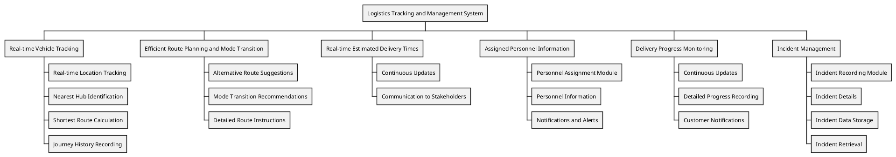

# Work Breakdown Structure

## Logistics Tracking and Management System

The Logistics Tracking and Management System is designed to optimize logistics operations, enhance efficiency, provide real-time visibility, optimize route planning, and facilitate incident resolution within the supply chain.

## Real-time Vehicle Tracking

The Real-time Vehicle Tracking component is responsible for monitoring and updating transportation vehicle locations based on zip codes. It includes:

- **Real-time Location Tracking**: Continuously tracks the precise location of transportation vehicles.
- **Nearest Hub Identification**: Identifies the nearest hub based on the vehicle's current zip code.
- **Shortest Route Calculation**: Calculates the shortest route from the vehicle's current location to the nearest hub.
- **Journey History Recording**: Maintains a record of the journey history, including timestamps and hub visits.

## Efficient Route Planning and Mode Transition

The Efficient Route Planning and Mode Transition component optimizes routes and determines the most suitable mode of transportation. It includes:

- **Alternative Route Suggestions**: Provides alternative route suggestions in case of impassable routes or unavailable hubs.
- **Mode Transition Recommendations**: Recommends transitions between transportation modes for cost-effective and timely deliveries.
- **Detailed Route Instructions**: Offers detailed instructions for alternative routes and mode transitions.

## Real-time Estimated Delivery Times

The Real-time Estimated Delivery Times component provides customers and stakeholders with accurate estimated delivery times. It includes:

- **Continuous Updates**: Continuously updates estimated delivery times based on real-time tracking and optimization.
- **Communication to Stakeholders**: Communicates estimated delivery times to customers, suppliers, and stakeholders.

## Assigned Personnel Information

The Assigned Personnel Information component associates each vehicle with responsible personnel. It includes:

- **Personnel Assignment Module**: A module for linking vehicles with designated staff members.
- **Personnel Information**: This includes contact details, roles, responsibilities, and performance records.
- **Notifications and Alerts**: Sends notifications and alerts to responsible personnel for critical information.

## Delivery Progress Monitoring

The Delivery Progress Monitoring component tracks the progress of each delivery order with granularity. It includes:

- **Continuous Updates**: Continuously updates and displays delivery progress.
- **Detailed Progress Recording**: Records details such as completion percentage, estimated time to completion, and exceptional circumstances.
- **Customer Notifications**: Sends timely notifications to customers regarding delivery status and delays.

## Incident Management

The Incident Management component records and manages incidents promptly. It includes:

- **Incident Recording Module**: A module for recording and categorizing incidents at hubs or involving vehicles.
- **Incident Details**: Captures details such as time of occurrence, incident nature, involved parties, and descriptions.
- **Incident Data Storage**: Securely stores incident data for analysis, resolution, and improvement.
- **Incident Retrieval**: Efficiently retrieves incident records for reporting and compliance.

	This comprehensive breakdown outlines the purpose and scope of each component within the Logistics Tracking and Management System, providing a clear understanding of its functionality.

