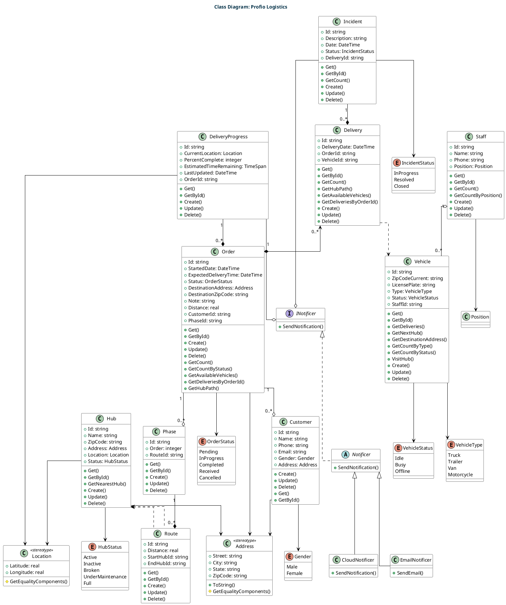

# C4 Model

	The C4 model is an "abstraction-first" approach to diagramming software architecture, based upon abstractions that reflect how software architects and developers think about and build software. The small set of abstractions and diagram types makes the C4 model easy to learn and use. C4 stands for context, containers, components, and code — a set of hierarchical diagrams that you can use to describe your software architecture at different zoom levels, each useful for different audiences.

## System Context Diagram

	The above diagram shows the context of the system. The system is a web application that is used to manage logistics. The system is used by the customer and the driver. The customer is the person who is using the system to manage their order. The driver is the person who is responsible for delivering the goods to the customer.

## Container Diagram

	The above diagram shows the containers of the system. The system is a web application that is used to manage logistics. The system is used by the customer and the driver. The customer is the person who is using the system to manage their order. The driver is the person who is responsible for delivering the goods to the customer. The system is hosted on a cloud platform. The system is built using the following technologies: Next.js, ASP.NET Core, Redis and PostgreSQL.

## Component Diagram

	The above diagram shows the components of the system. The system is a web application that is used to manage logistics. It's show the components of the system such as: Order Catalog, Access Control, Hub Management and Driver Catalog.

## Code Diagram

The above diagram shows the code of the system (aka **Class Diagram**). The system is a web application that is used to manage logistics. It's show the classes of the system such as: Customer, Order, DeliveryProgress, Phase, Route, Hub, Delivery, Vehicle, Staff, Incident, Address, Location, INotificer, Notificer, EmailNotificer and CloudNotificer.

